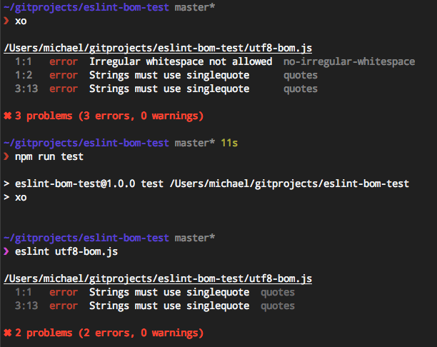

# eslint-bom-test

This module is simply for diagnostic purposes to help demonstrates the problems listed in the following issues:

ESLint Issue [#5766](https://github.com/eslint/eslint/issues/5766)  
XO Issue [#96](https://github.com/sindresorhus/xo/issues/95)

## Install 

```
$ git clone https://github.com/radiovisual/eslint-bom-test.git
$ cd eslint-bom-test
$ npm install
```

## Recreate the Problem

The following command yields **no results:**
```
$ npm run test
```

However, the following command yields **3 errors:**
```
$ xo
```

<pre>
/Users/michael/gitprojects/eslint-bom-test/utf8-bom.js
  1:1   error  Irregular whitespace not allowed  no-irregular-whitespace
  1:2   error  Strings must use singlequote      quotes
  3:13  error  Strings must use singlequote      quotes
</pre>

## The Problem?

The problem is that both commands `$ npm run test` and `$ xo` should return the same results, **and** XO should be ignoring 
 the Unicode BOM, because [ESLint strips the Unicode BOM from files before linting](https://github.com/eslint/eslint/issues/4878).

## Trying Straight ESLint

Notice how running this command:

```
$ eslint utf8-bom.js
```

Results in the output you would expect:

<pre>
  1:1   error  Strings must use singlequote  quotes
  3:13  error  Strings must use singlequote  quotes
</pre>
  


## Notes

The contained file `utf8-bom.js` has an intentional UTF8 BOM character at the beginning of the file.

